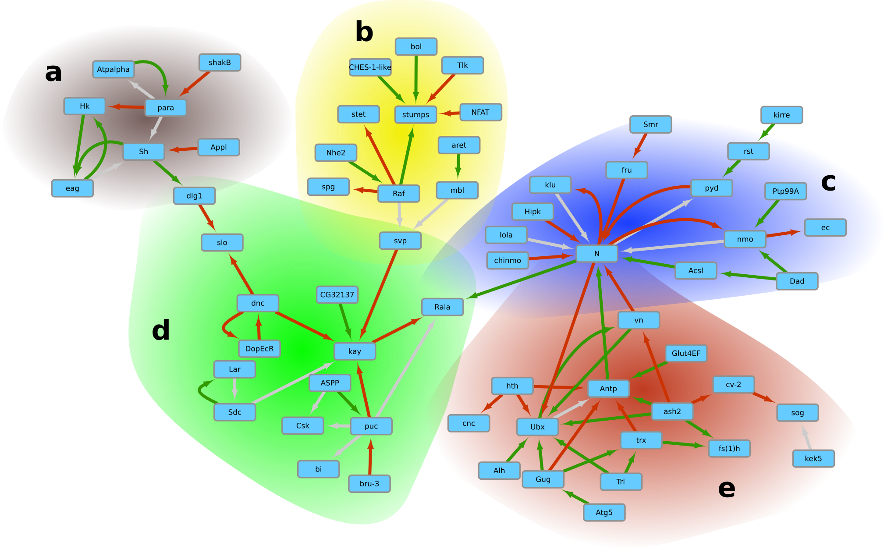
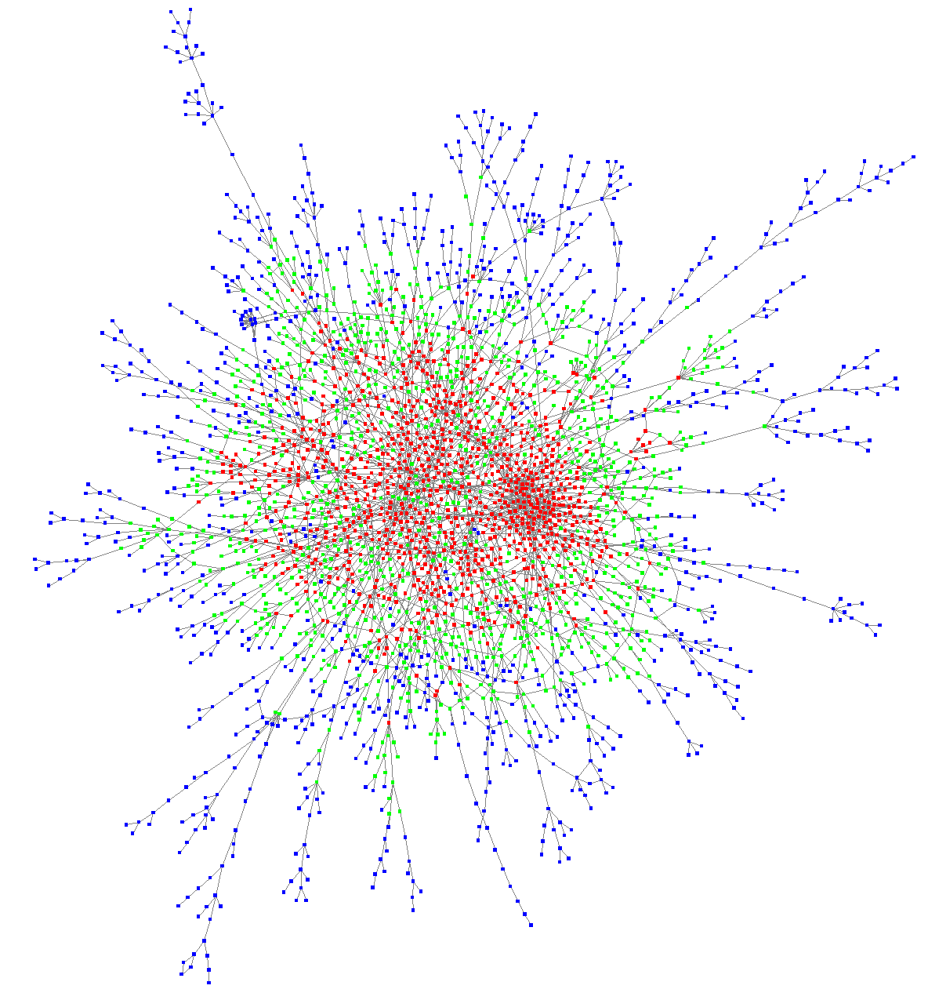

+++
# Project title.
title = "Complex Network Mining"

# Date this page was created.
date = 2019-10-25T00:00:00

# Project summary to display on homepage.
summary = "Multidimensional networks mining in different fields of application."

# Tags: can be used for filtering projects.
# Example: `tags = ["machine-learning", "deep-learning"]`
tags = ["Computational Biology", "Graph Mining", "Active Project"]

# Optional external URL for project (replaces project detail page).
#external_link = ""

# Slides (optional).
#   Associate this project with Markdown slides.
#   Simply enter your slide deck's filename without extension.
#   E.g. `slides = "example-slides"` references 
#   `content/slides/example-slides.md`.
#   Otherwise, set `slides = ""`.
#slides = "example-slides"

# Links (optional).
url_pdf = ""
url_slides = ""
url_video = ""
url_code = ""

# Custom links (optional).
#   Uncomment line below to enable. For multiple links, use the form `[{...}, {...}, {...}]`.
#links = [{icon_pack = "fab", icon="twitter", name="Follow", url = "https://twitter.com/georgecushen"}]

# Featured image
# To use, add an image named `featured.jpg/png` to your project's folder. 
[image]
  # Caption (optional)
  caption = "A gene interaction network"
  
  # Focal point (optional)
  # Options: Smart, Center, TopLeft, Top, TopRight, Left, Right, BottomLeft, Bottom, BottomRight
  focal_point = "Smart"
+++

#### Active since 2015

## Research rationale
Network data modeling has emerged in various disciplines as a unified way of representing complex relational data.
Formally, these complex networks (which we call multidimensional networks) are multigraphs for which nodes and edges are (multi-)labeled.
The core of our research activity focuses on analyzing these complex networks for information extraction purposes [^Pasquier2018].

## Results

### Prediction of microRNA-disease associations
A [microRNA](https://en.wikipedia.org/wiki/MicroRNA) (miRNA) is a small RNA molecule that, by its ability to regulate gene expression, plays a critical role in many physiological processes.
Since its discovery, a great deal of information has been gained about its involvement in disease development and drug resistance.
However, there is still much to be done to gain a full understanding of the miRNA world.
A challenge for miRNA research is establishing a clear relationship between miRNA dysregulation, target dysregulation and ultimate biological impact.
Computational methods can make an important contribution to this goal.

To this end, we have been working on a new method to predict associations between miRNAs and diseases.
Its principle involves representing miRNAs and their links with elements highlighting various facets of these molecules (targeted genes, neighboring miRNAs, terms associated with them in scientific articles) in the form of a multidimensional network and then projecting this network into a vector space in order to use metrics within this space to predict MiRNA-disease associations.
The performance of our algorithm, [MiRAI](/software/mirai), was characteristic of an excellent classifier and corresponded to the state of the art in the field [^Pasquier2016a].
Subsequently, we proposed an improvement by using a parallel surrogate-assisted evolutionary algorithm to automatically find an optimal configuration of our predictive method [^Pallez2017].

### Study of triplex topology
It has been known since the 1960s that some short RNA sequences are likely to match particular areas of DNA to form triple-stranded structures called [triplex DNA](https://en.wikipedia.org/wiki/Triple-stranded_DNA).
We have undertaken an in silico study to locate, quantify and analyze triplex DNA on a genome in order to increase our knowledge of these structures.
Our analyses, which identified many potential triplex sites within the genes, strongly suggest that some RNA fragments, coding or not, could have a significant influence on many chromosomal loci for large-scale genetic or epigenetic controls.
This study paves the way for a new possible pathway for genetic regulation through RNA fragments [^Pasquier2017a].

**Network of genetic interactions via lncRNA:DNA triplex formation highlighting 5 sub-networks corresponding to distinct processes.**
*More details can be found in our article on triplex analysis [^Pasquier2017a].*

### Computational analysis of double-stranded RNA
RNA interference (RNAi) refers to a conserved post-transcriptional mechanism for the degradation of RNA by short double-stranded RNAs (dsRNAs).
A genome-wide analysis of mRNAs that are complementary to RNAs was performed through computational searches in the Drosophila model.
We report segments originating from pre-mRNAs introns and exons as well as lncRNAs as potential sources of siRNAs.
The computationally predicted interactions have been modeled as a network in which we have noted that the central genes (those potentially most regulated by RNA interference) are strongly involved in the processes of development, morphogenesis and neurogenesis.
The distribution of the genes for which transcripts are engaged in intermolecular segmental pairing is largely lacking in the gene collections defined as showing no expression in each individual developmental stage from early embryos to adulthood.
This trend was also observed for the genes showing very low expression from the 8-12-hour embryonic to larval stage 2.
These results suggest a genome-wide scale of mRNA homeostasis via RNAi metabolism and could extend the known roles of canonical miRNAs and hairpin RNAs [^Pasquier2020].

**Network of RNA-RNA interactions in which central genes are involved in development, morphogenesis and neurogenesis processes.**

### Active module identification
The identification of condition specific gene sets from transcriptomic experiments has important biological applications, ranging from the discovery of altered pathways between different phenotypes to the selection of disease-related biomarkers.
Statistical approaches using only gene expression data are based on an overly simplistic assumption that the genes with the most altered expressions are the most important in the process under study.
However, a phenotype is rarely a direct consequence of the activity of a single gene, but rather reflects the interplay of several genes to perform certain molecular processes.
We are working on different approaches to analyze gene activity in the light of our knowledge about their molecular interactions.
These include a population-based meta-heuristics based on new crossover and mutation operators [^Correa2019] as well as methods based on network embedding.

### Sentiment analysis and multi-domain transfer
Sentiment analysis consists of automatically determining the polarity (positive, negative or neutral) of documents.
In this field of research, we particularly study how different polarities, depending on the domain, can be learned for the same concept.
The approach we are developing consists in combining a multidimensional graph representing the semantics of terms with a method of propagation of polarities using fuzzy logic.
Our method shows improved performance over the state of the art, good cross-domain generalization capabilities, and an excellent coverage [^Pasquier2020a].

#### Funding

| Program             | ARC fundation grant                             |
| ------------------- |:----------------------------------------------------------------------- |
| Year                | 2017-2018                                                               |
| Funder              | ARC                                       |
| Grant name          | Role of electrical remodeling of pancreatic adenocarcinoma epithelial cells in response to the micro environment |
| Project coordinator | Olivier Soriani                                                           |

| Program             | PhD grant                             |
| ------------------- |:----------------------------------------------------------------------- |
| Year                | 2017-2020                                                               |
| Funder              | Université Côte d'Azur                                        |
| Grant name          | Multi-objective evolutionary algorithms for the identification of master regulators in pancreatic cancer |
| Grant recipient     | Leandro Corrêa |
| Project coordinator | Claude Pasquier                                                           |

#### Softwares
* [MIRAI](/software/mirai): Prédiction of miRNA-disease associations

#### Publications related to this theme
[^Pasquier2018]: 
[^Pasquier2016a]: 
[^Pallez2017]: 
[^Pasquier2017a]: 
[^Pasquier2020]: 
[^Correa2019]: 
[^Pasquier2020a]: 

